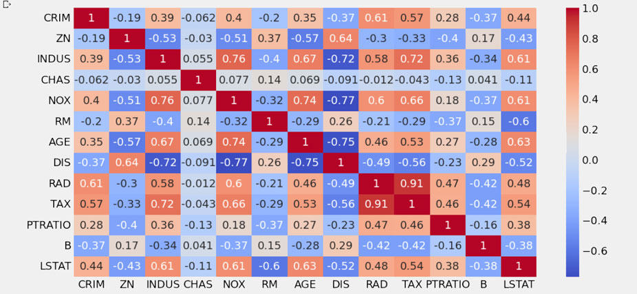

# Docker CI/CD Python App



#### -- Project Status: [Completed]

## Objective
Build a simple Python application, containerize it using Docker, automate the build and push process using GitHub Actions for Continuous Integration and Continuous Delivery (CI/CD).

### Project structure
* `.github/workflows/main.yml` - GitHub Actions workflow for CI/CD
* `.dockerignore` - Files and directories excluded from Docker builds
* `.gitignore` - Files and directories excluded from Git version control
* `Dockerfile` - Instructions to containerize the application
* `compose.yaml` - Docker Compose file (optional for future use)
* `main.py` - Main Python application file
* `requirements.txt` - Python dependencies

### Technologies and packages
* Python 3.12
* Docker
* Docker Compose
* GitHub Actions

### Setup instructions

#### Run Docker Init to create Dockerfile
```bash
docker init

# Answer prompts:
# - Platform: Python
# - Python version: 3.12.10
# - Port: 8002
# - Run command: python main.py
```

#### GitHub Actions CI/CD
* Set up Docker Hub credentials in GitHub Actions (Settings -> Secrets and Variables -> Actions)
* Add variable DOCKER_USERNAME and secret DOCKERHUB_TOKEN
* Push to `main` branch automatically triggers Docker image build and pushes to Docker Hub

#### Run locally with Docker
```bash
docker build -t docker_ci_cd_app .
docker run docker_ci_cd_app
```
